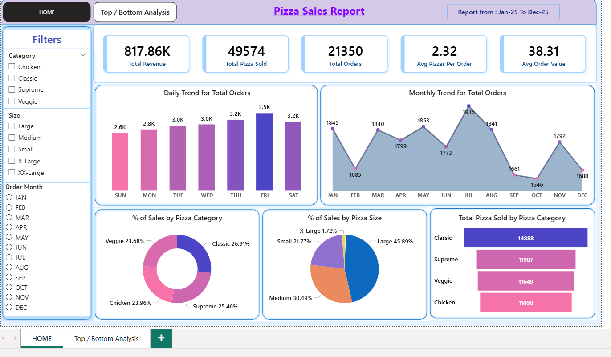

# Project Title: Pizza Data Analysis

This project demonstrates SQL techniques used by analysts to explore, clean, and analyze pizza sales and customer data. The analysis focuses on understanding order patterns, revenue, customer behavior, and menu performance to support business decision-making. And Power BI is used to represent the Business insights.

## Objectives
- Build a clean, usable pizza sales dataset and simple relational model.
- Clean and validate data (remove nulls, normalize types and categories).
- Perform EDA to uncover time, product, and customer patterns.
- Produce actionable business insights for menu, marketing, and operations.

## Dataset
- `orders_2025` — order_id, custid, order_date, order_time, status
- `order_details` — order_details_id, order_id, pizza_id, quantity
- `pizzas_info_2025` — pizza_id, pizza_type_id, size, price
- `pizza_types` — pizza_type_id, name, category, ingredients

## Data cleaning & exploration
- Count records per table and verify primary keys.
- Check and fix missing or inconsistent values in critical fields.
- Enforce correct types for dates, times, numeric price, and integer quantities.
- Standardize categorical values (size, category) and trim whitespace.

## Analysis checklist (queries & insights)
- Orders volume: unique orders, monthly and weekday trends, peak hours.
- Revenue: total revenue, cumulative revenue, revenue by category/size.
- Menu performance: top/bottom sellers, top 3 by category, price-based rankings.
- Customer analysis: repeat customers, simple RFM-like segmentation, CLV.
- Operational metrics: avg order size, pizzas per day, staffing windows.
- Advanced: basket combinations, profitability estimates, simple next-month forecast.

## Key findings (example outcomes)
- Order trends: clear peak hours and weekend lifts, seasonality by month.
- Menu insights: a small number of pizzas contribute most revenue; sizes skew toward M/L.
- Revenue dynamics: monthly growth and category-level share identified.
- Operational action: staffing and promo windows recommended around peak hours.

## Dashboard screenshots

  
  

